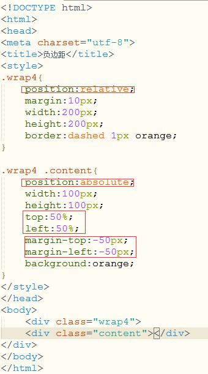
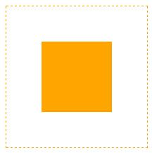
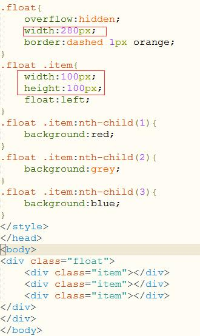
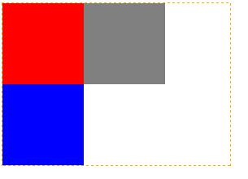
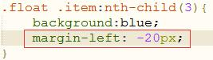
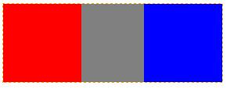
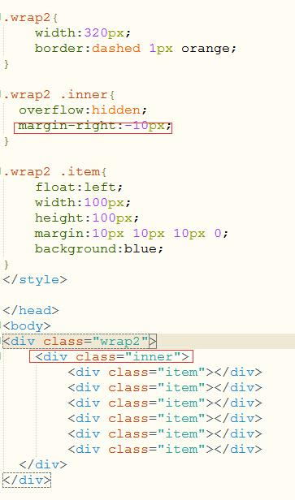

#负边距

负边距即margin属性的值设为负值，在CSS布局中时一个很有用的技巧。值为正的场景很常见，当`margin-top,margin-left`为负值的时候，会把元素上移、左移，同时文档流中的位置也发生相应变化,这点与position:relative的元素设置top、left后元素还占据原来位置不同

当`margin-bottom,margin-right`设为负值的时候，元素本身没有位置变化，后面的元素会下移、右移

###应用场景

####绝对定位居中的应用

效果如下：

####float元素

负边距对float元素的影响也是按照上面说的，不过有其特殊性，我们看个例子就很清楚了

 

有三个div的宽度之和是300px，大于280px，一行排不满，如果第三个div改成下图：

就可以显示在一行,如下图：

####带有右边距的浮动子元素列表

看到这种效果你第一想法是什么？会不会是子元素设置margin-right，在遍历的时候nth-child(3n)还要设置为0，看看利用上面知识我们可以怎样处理。

没有设置nth-child(3n)的边距为0，是通过负边距使父元素“变大”。